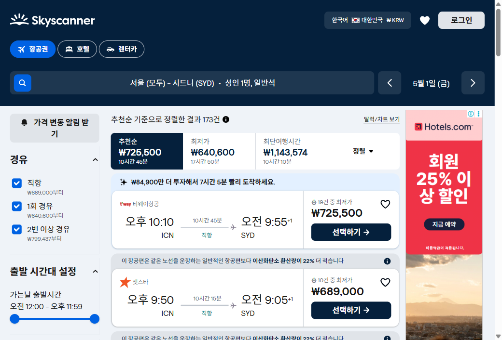
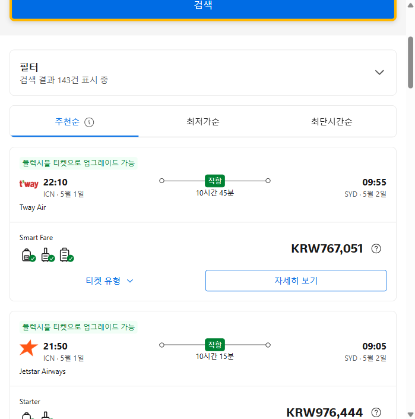
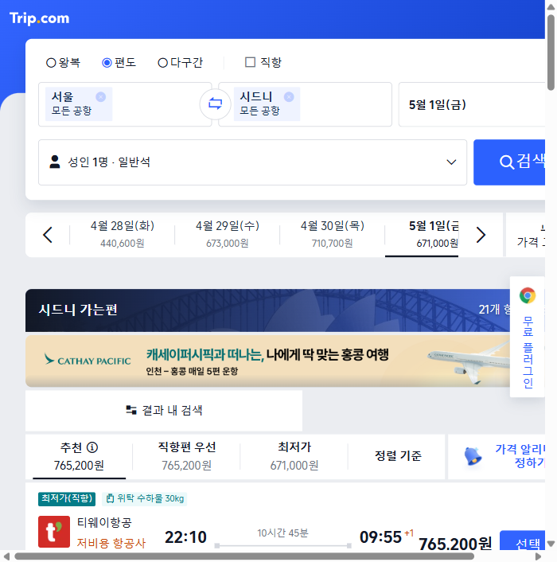

# 서울 → 시드니 5월 항공권 가격 비교

> 조회 일시: 2026년 4월 20일  
> 구간: 서울(ICN) → 시드니(SYD) | 편도 | 성인 1명 | 일반석 | 출발일: 2026년 5월 1일(금)

---

## 1. 스카이스캐너 (Skyscanner)

**URL:** https://www.skyscanner.co.kr/transport/flights/SEL/SYD/260501/  
**총 검색 결과:** 173건

### 주요 결과 요약

| # | 항공사 | 출발 | 도착 | 소요시간 | 경유 | 가격(KRW) |
|---|--------|------|------|----------|------|-----------|
| 1 | 티웨이항공 | 22:10 ICN | 09:55+1 SYD | 10시간 45분 | 직항 | ₩725,500 |
| 2 | 젯스타 | 21:50 ICN | 09:05+1 SYD | 10시간 15분 | 직항 | ₩689,000 |
| 3 | 콴타스항공(젯스타 운항) | 21:50 ICN | 09:05+1 SYD | 10시간 15분 | 직항 | ₩763,100 |
| 4 | 대한항공 | 19:10 ICN | 06:20+1 SYD | 10시간 10분 | 직항 | ₩1,143,574 |
| 5 | 핀에어(젯스타 운항) | 21:50 ICN | 09:05+1 SYD | 10시간 15분 | 직항 | ₩770,000 |
| 6 | 아시아나항공 | 20:10 ICN | 07:30+1 SYD | 10시간 20분 | 직항 | ₩1,284,669 |
| 7 | 아시아나(대한항공 운항) | 19:10 ICN | 06:20+1 SYD | 10시간 10분 | 직항 | ₩1,317,300 |
| 8 | 에어프랑스(대한항공 운항) | 19:10 ICN | 06:20+1 SYD | 10시간 10분 | 직항 | ₩1,317,300 |
| 9 | 홍콩항공 | 14:45 ICN | 09:35+1 SYD | 17시간 50분 | 1회(HKG) | ₩640,600 |
| 10 | 캐세이퍼시픽항공 | 20:05 ICN | 11:45+1 SYD | 14시간 40분 | 1회(HKG) | ₩1,226,324 |
| 11 | 대한항공+버진오스트레일리아 | 20:05 ICN | 10:40+1 SYD | 13시간 35분 | 1회(BNE) | ₩1,260,900 |

**최저가:** ₩640,600 (홍콩항공, 1회 경유 17시간 50분)  
**직항 최저가:** ₩689,000 (젯스타, 10시간 15분)  
**추천순 1위:** ₩725,500 (티웨이항공, 직항 10시간 45분)

---

## 2. 부킹닷컴 (Booking.com)

**URL:** https://www.booking.com/flights/search/index.ko.html?type=ONEWAY&from=ICN&to=SYD&depart=2026-05-01&adults=1&cabinClass=ECONOMY  
**총 검색 결과:** 143건

### 주요 결과 요약

| # | 항공사 | 출발 | 도착 | 소요시간 | 경유 | 가격(KRW) |
|---|--------|------|------|----------|------|-----------|
| 1 | Tway Air (티웨이항공) | 22:10 ICN | 09:55+1 SYD | 10시간 45분 | 직항 | KRW 767,051 |
| 2 | Jetstar Airways (젯스타) | 21:50 ICN | 09:05+1 SYD | 10시간 15분 | 직항 | KRW 976,444 |

> 참고: 부킹닷컴은 스카이스캐너 대비 동일 노선 가격이 다소 높게 표시됨 (플랫폼 수수료 포함 가능)

---

## 3. 트립닷컴 (Trip.com)

**URL:** https://kr.trip.com/flights/seoul-to-sydney/tickets-sel-syd/?dcity=sel&acity=syd&ddate=20260501&triptype=ow&class=y&quantity=1  
**총 검색 결과:** 21개 항공편

### 날짜별 최저가 캘린더

| 날짜 | 최저가 |
|------|--------|
| 4월 28일(화) | ₩440,600 |
| 4월 29일(수) | ₩673,000 |
| 4월 30일(목) | ₩710,700 |
| 5월 1일(금) | ₩671,000 |

### 주요 결과 요약

| 정렬 기준 | 항공사 | 시간 | 가격(KRW) |
|-----------|--------|------|-----------|
| 추천 | 티웨이항공 | 22:10 → 09:55+1 (10시간 45분) | ₩765,200 |
| 직항편 우선 | 티웨이항공 | 22:10 → 09:55+1 | ₩765,200 |
| 최저가 | - | - | ₩671,000 |

**최저가:** ₩671,000  
**추천 항공편:** 티웨이항공 직항 ₩765,200 (위탁수하물 30kg 포함)  
**광고 제휴:** 캐세이퍼시픽 (인천-홍콩 매일 5편 운항)

---

## 종합 비교표

| 사이트 | 직항 최저가 | 전체 최저가 | 추천 항공편 | 검색 결과 수 |
|--------|------------|------------|------------|-------------|
| 스카이스캐너 | ₩689,000 (젯스타) | ₩640,600 (홍콩항공 경유) | ₩725,500 (티웨이항공) | 173건 |
| 부킹닷컴 | ₩767,051 (티웨이항공) | ₩767,051 | ₩767,051 (티웨이항공) | 143건 |
| 트립닷컴 | ₩765,200 (티웨이항공) | ₩671,000 | ₩765,200 (티웨이항공) | 21건 |

---

## 요약 및 추천

### 가장 저렴한 직항
- **젯스타 ₩689,000** (스카이스캐너 기준) — ICN 21:50 출발, SYD 09:05 도착, 10시간 15분

### 가성비 추천
- **티웨이항공 ₩725,500~765,200** — 국적 저가항공사, 직항, 10시간 45분 소요

### 가격 비교 팁
- 스카이스캐너가 가장 많은 결과(173건)와 가장 낮은 가격을 제공
- 부킹닷컴·트립닷컴은 스카이스캐너 대비 동일 편 가격이 5~40% 높게 표시
- 4월 28일 출발 시 ₩440,600 (트립닷컴 기준) 으로 훨씬 저렴
- 경유를 감수하면 홍콩항공 ₩640,600 (HKG 경유, 17시간 50분) 이 최저

> 모든 가격은 세금·수수료 포함 기준이며 조회 시점에 따라 변동될 수 있습니다.
