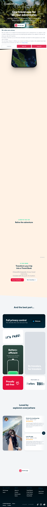
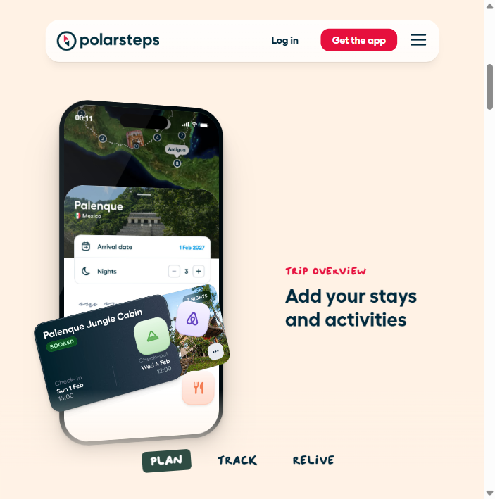
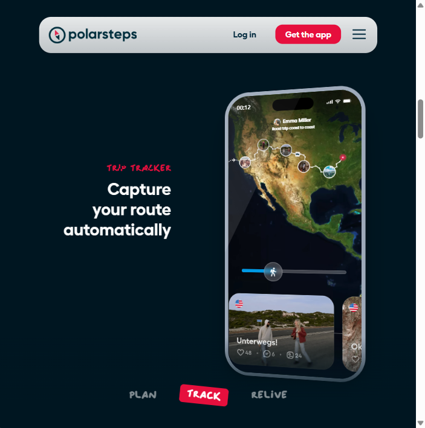
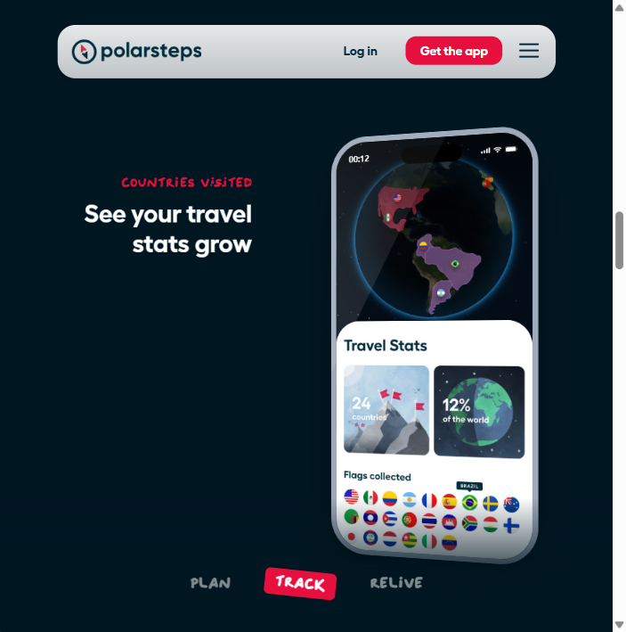
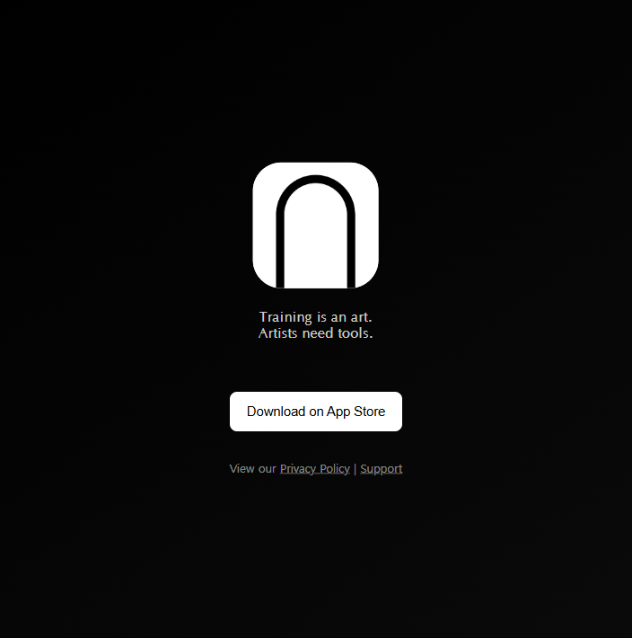
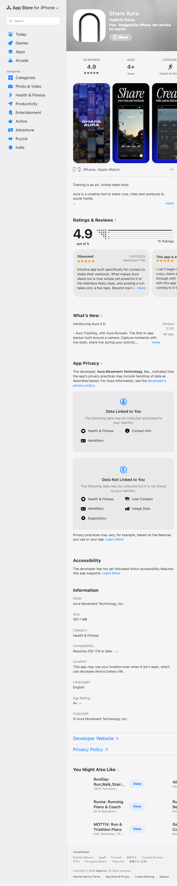

# 경쟁 서비스 리서치 — Marked 프로젝트

> 기준: 2025–2026년 자료 / DEV.md 참고 앱 3개 기반 분석 / Playwright MCP 직접 탐색

---

## 분석 대상 서비스

| 구분 | 서비스 | 포지션 |
|------|--------|--------|
| 국내 | 포토로그 (Photolog) | 여행 기록 일지 |
| 해외 | Polarsteps | 여행 카운팅 & 트래킹 |
| 인접 카테고리 | ShareAura (Share Your Runs) | 운동 인증샷 공유 |

---

## 1. 포토로그 (Photolog) — 국내

**앱스토어 링크**: [App Store](https://apps.apple.com/kr/app/포토로그/id1195289279) / 공식 사이트: photolog.kr

### 스크린샷

### 핵심 가치 제안
> "지도 위에 기록하는 나만의 여행"
사진을 지도 위에 핀으로 꽂아 여행 기록을 시각화. 방문한 지역을 색으로 채워가는 여행 지도 생성.

### 주요 기능 3개
1. **여행 지도 생성** — 방문 도시·나라를 지도 위에 색으로 채움
2. **사진 로그** — 카테고리(관광지, 맛집, 카페, 숙소, 액티비티)별 사진 핀 등록
3. **SNS 공유** — 댓글, 지도 공유, 팔로우 기능

### 가격 정책
- 무료 (앱 내 기능 전체 무료)

### UX 특징
- 지도 중심 UI, 직관적인 핀 등록 방식
- 여행 기록 + 지도 시각화의 깔끔한 조합
- 모바일 전용 앱 (웹 없음)

### 현황 (2025–2026)
- **마지막 업데이트: 2021년 8월** → 사실상 유지보수 중단 상태
- 삼성 커뮤니티에 "포토로그 앱 없어졌나요?" 문의 다수 → 서비스 불안정 신호
- 신규 기능 추가 없음, 버그 미수정

### 유저 불만
- 업데이트 없어서 최신 OS에서 불안정
- 운동 기록 기능 전혀 없음 (순수 여행 사진 기록 앱)
- 러닝코스 등록·탐색 기능 없음

---

## 2. Polarsteps — 해외

**공식 사이트**: polarsteps.com

### 스크린샷

### 핵심 가치 제안
> "여행을 자동으로 기록하고 아름답게 공유"
GPS로 여행 경로를 자동 추적. 최소한의 노력으로 여행 일지 완성. 실물 여행 책 출력 가능.

### 주요 기능 3개
1. **GPS 자동 여행 트래킹** — 배터리 소모 약 4%로 하루 종일 경로 자동 기록
2. **나라·도시 카운팅** — 방문한 국가 수, 여행 일수 자동 집계 + 지도 시각화
3. **여행 책 인쇄** — 디지털 여행 기록을 실물 포토북으로 출력 (€36–€150)

### 가격 정책
- **앱 자체는 무료**
- 여행 포토북 인쇄: €36–€150 (페이지 수, 제본 방식에 따라 상이)
- 2권 구매 시 10% 할인, 3권 이상 15% 할인 + 전 세계 무료 배송

### UX 특징
- GPS 자동 트래킹 → 유저가 직접 입력할 필요 없음 (낮은 진입 장벽)
- 오프라인 작동 가능 (인터넷 연결 없이도 경로 기록 → 나중에 동기화)
- 동적 지도가 메인 UI, 사진 오버레이로 시각적으로 풍부

### 유저 불만 (2025 Trustpilot·Product Hunt 기반)
- **경로 오류 수정 불가**: 앱이 임의로 "유령 비행" "순간이동" 경로를 추가하는데 편집·삭제 불가
- **협업 불가**: 같이 여행해도 한 사람 계정에서만 사진·메모 추가 가능 → 커플·그룹 여행 불편
- **버그**: 간헐적 앱 크래시, 여행 세부 정보 유실
- **여행 병합 불가**: 여행을 나눠서 기록 후 합치는 기능 없음
- **운동 기록 전무**: 러닝·운동 스탯 입력·표시 기능 없음 (순수 여행 앱)

---

## 3. ShareAura (Share Your Runs) — 인접 카테고리

**공식 사이트**: shareaura.app  
**App Store**: [Share Aura – Share Your Runs](https://apps.apple.com/us/app/share-aura/id6742422198)  
**개발사**: Aura Movement Technology, Inc.

### 스크린샷

### 핵심 가치 제안
> "운동 기록을 감성적인 카드로 만들어 소셜미디어에 공유"
러닝·라이딩·운동 스탯을 20+ 디자인 템플릿에 합성해 인스타그램 등 SNS에 바로 공유.

### 주요 기능 3개
1. **스탯 카드 디자인** — 거리, 페이스, 시간을 8가지 stat 템플릿 + 20+ 디자인 요소로 꾸밈
2. **레이아웃 & 오버레이** — 12 preset 레이아웃, 11 콜라주 레이아웃, 90+ 프롬프트 오버레이, 레이스 카드 프리셋
3. **클립보드 복사** — 스티커를 클립보드에 복사해 다른 앱에 붙여넣기 가능

### 가격 정책
- iOS 전용 (App Store)
- 무료 기본 기능 + 프리미엄 템플릿 유료 추정 (앱 내 구매)

### UX 특징
- Strava 또는 운동 기록 앱 연동 → 스탯 자동 불러오기
- 인스타그램 공유에 최적화된 가로·세로 비율
- 감성 디자인 중심, 운동 기록 자체 저장 기능은 없음

### 유저 불만 (2025 기준)
- **여행 기능 없음**: 어느 도시에서 뛰었는지 기록·탐색 기능 전무
- **기록 관리 없음**: 과거 운동 히스토리 앱 내 저장 안 됨 → 공유 도구일 뿐
- **Android 미지원**: iOS 전용으로 안드로이드 유저 소외
- **도시 카운팅 없음**: "몇 개 도시에서 뛰었나" 집계 불가

---

## 비교표

| 항목 | 포토로그 | Polarsteps | ShareAura |
|------|---------|-----------|---------|
| **핵심 타겟** | 여행 기록 좋아하는 국내 유저 | 장거리 여행자 (GPS 자동 기록 원하는) | 러닝·운동 후 SNS 공유하는 피트니스 유저 |
| **운동 코스 탐색** | ❌ | ❌ | ❌ |
| **운동 기록 입력** | ❌ | ❌ | ✅ (스탯 표시용) |
| **여행 + 운동 통합** | ❌ | ❌ | ❌ |
| **인증샷 카드 생성** | ❌ | ❌ | ✅ |
| **나라·도시 카운팅** | ✅ (지도) | ✅ (자동 GPS) | ❌ |
| **SNS 공유** | ✅ | ✅ | ✅ (핵심 기능) |
| **국내 서비스** | ✅ | ❌ | ❌ |
| **가격** | 무료 | 무료 (책 인쇄 유료) | 무료 + 인앱 결제 |
| **서비스 상태** | ⚠️ 2021년 이후 업데이트 없음 | ✅ 활성 | ✅ 활성 |
| **Android 지원** | ✅ | ✅ | ❌ (iOS 전용) |

---

## Marked의 차별화 포인트 (내가 더 잘할 수 있는 것 3가지)

### 1. 여행 + 러닝을 하나로 합친 유일한 앱
Polarsteps는 여행 카운팅만, ShareAura는 운동 인증샷만, 포토로그는 사진 일지만 한다.
**Marked는 이 세 가지를 러닝에 특화해 하나로 합친 유일한 앱**이다.
"내가 뛴 도시"가 곧 여행 기록이 되고, 뛴 기록이 곧 감성 인증샷 카드가 된다.

### 2. 국내 여행러너 공백 공략
포토로그는 사실상 서비스 종료 상태 (2021 이후 업데이트 없음).
국내 여행 + 운동 기록 앱 시장에 **공백**이 생긴 상황.
한국어 UI, 한국 도시(부산, 제주, 강릉 등) 코스 DB, 국내 러닝 커뮤니티 특화 전략으로 진입 가능.

### 3. 스탬프 카드 = 바이럴 콘텐츠 자체
ShareAura는 스탯 카드를 만들지만 "어느 도시에서 뛰었는지"가 보이지 않는다.
Marked의 스탬프 카드는 **도시명 + 날짜 + 나라 + 운동 스탯**이 모두 담긴다.
카드 자체가 "나 부산에서 뛰었어"를 증명하는 여행 인증샷이 되어 자연 바이럴 발생.

---

## AUDIENCES.md 인풋 — 경쟁 서비스 유저들의 불만 단서

### 포토로그 유저 불만
- 2021년 이후 업데이트 없어 최신 OS 호환 불안정
- 운동 기록 기능이 아예 없어서 러닝 기록은 따로 다른 앱 사용
- "앱이 없어진 거냐"는 문의가 계속 나올 정도로 신뢰 감소

### Polarsteps 유저 불만
- GPS 경로가 틀려도 수동 수정 불가 → 기록 신뢰도 저하
- 함께 여행한 동행자와 기록 공유·합산 불가 (커플 여행 불편)
- 운동(러닝) 스탯 기록 기능 없음 → 운동 여행자는 앱을 2개 써야 함

### ShareAura 유저 불만
- 공유 도구일 뿐, 과거 기록 히스토리 조회 불가
- "몇 개 도시에서 뛰었나" 집계 불가 → 성취감·게임 요소 없음
- iOS 전용으로 안드로이드 유저 사용 불가

### Marked가 공략할 수 있는 갭
- **Polarsteps 유저**: 여행 중 러닝하는데 운동 기록까지 한 앱으로 하고 싶다 → Marked로 전환
- **ShareAura 유저**: 어느 도시에서 뛰었는지 기록하고, 쌓인 도시 수를 보고 싶다 → Marked로 전환
- **포토로그 이탈 유저**: 대체 여행 기록 앱을 찾는 국내 유저 → Marked로 흡수
